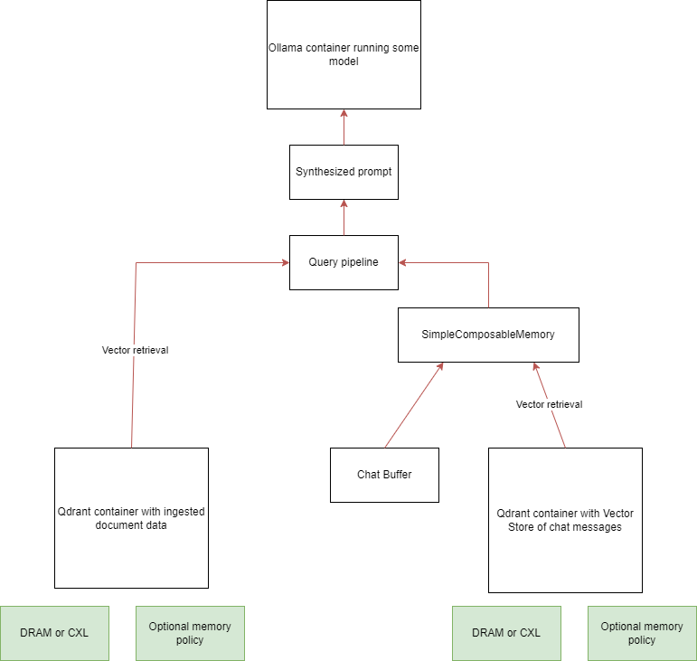

## Installation

*Optional: If you're planning to use Kernel TPP, install Ubuntu 24.04 and Kernel 6.9*

Prerequisites: python3 and pip

Create a new virtual environment using `python3 -m venv`.
Activate the VE using `source`
If not already installed, install docker as shown [here.](https://docs.docker.com/engine/install/ubuntu/)
Install dependencies by `cd`ing into the FMSDemo/ directory and running `pip install -r requirements.txt`

## Running the Demo

With the virtual environment activated, `cd` into the scripts/ directory and run `streamlit run fmsdemo.py`

The web UI will guide you through the demo. Streamlit will print how to access it to the terminal. If you'd like to only have to ingest your data once while using it multiple times, create a Qdrant container with the argument `-v volume_name:/qdrant`. Then, ingest the data into the container. The container's state will be saved into volume_name, so simply pass that (and the name of the collection created within the container) into the appropriate fields of the UI. More details on this are in the **Examples** section.

#### A few notes:

- When specifying CPU and NUMA nodes, use single numbers, hyphens for ranges, or commas for multiple (eg 0 or 7-10 or 3,5)
- Note that LlamaIndex will attempt to ingest *everything* located in the directory specified in the Data directory field. The data directory specified must exist and should only contain textual data (but text can be in a variety of file types, eg .txt and .pdf)
- Where the streamlit command is run affects how paths entered into the demo are interpreted. Eg if the command is run within the scripts/ directory, entering data/ as the data directory in the UI will look for a directory called data/ within scripts/ (i.e a path like $HOME/scripts/data/)
- The demo should automatically clear any containers it's created. However, bugs or certain actions (eg refreshing the page in the middle of the demo) may prevent this from happening. In this case, you'll have to manually remove the containers created by the script (FMSDemo_doc_db and FMSDemo_chat_db)
- The `RELEVANT_DEMO_HISTORY` constant in fmsdemo.py contains a list of LlamaIndex chat messages. The script will always insert these messages into the chat vector database
    - The purpose of these messages is to ensure that the chat database always contains at least some messages relevant to the documents, even if the rest of the database is filler or garbage used as padding to increase the overall database size and stress the system. These messages are what are ideally retrieved by the pipeline as context to enhance the LLM response
    - If the database is being created by the demo from scratch, it will solely consist of these messages 
    - If the database is being loaded from a volume containing a container state, the messages will be added into the loaded vector store
    - If you want to query from your own documents, you may want to change this constant. However, it's not necessary to have relevant messages in the secondary vector store

## Project architecture

The pipeline features some prompt chaining and pulls context from three sources: documents that have been ingested, the current session's chat history, and a cumulative chat history including messages from many past sessions. These last two sources are the components of the simple composable memory being used: the simple composable memory's primary source is the current chat buffer while its secondary source is a vector store containing a (potentially massive) amount of messages.

The goal is for this to simulate a RAG pipeline that goes beyond enhancing inference with document context. Imagine a cumulative database containing every past message sent by a user (or every user) from every past session. Not only can the model see past messages from its current session, it can also pull from this past message database to answer questions. So, a user could successfully ask something like "Can you summarize the results of our company's quarterly report?" (document context); "You mentioned x earlier. Can you explain that again differently?" (primary memory context); or "I remember you told me y about x yesterday. Could you elaborate more on that?" (secondary memory context).

Documents are queried through an index connected to one Qdrant docker container. The past chat history vector store is connected to another Qdrant container. The current chat history is managed by LlamaIndex. Ollama runs in its own container. When the demo runs, context is retrieved from the corresponding containers and combined into one final prompt which is then passed to the model running inside the Ollama container.

## Examples

All these examples assume the virtual environment has already been activated.

#### Provided sample demo configuration

The demo repository comes with some sample data and chat messages to use. To use it, do the following in the UI:

1. `cd` into FMSDemo/scripts, run `streamlit run fmsdemo.py`, and open the UI
2. Type in any random task label (eg "demo example")
3. Press the `Launch demo` button
- That's it! You can now input queries into the pipeline. The documents that were ingested by the script are a few Wikipedia articles and a paper on the origins of COVID (you can read the original documents yourself within the FMSDemo/data directory)
- The terminal contains additional program information. Notably, it contains more verbose output from the RAG pipeline
- When you're done, press the `Stop demo and show data` button. Optionally, you can then press `Save benchmark data to disk` to write measurements about the pipeline to a file

#### Preloading data into a database to avoid reingestion

This example goes over how to ingest a document dataset once using LlamaIndex to reingestion. The sample LlamaIndex program and process as a whole can easily be reused to fit your own use case with minimal modificaitons
1. `cd` into FMSDemo/examples/preload/
    - The articles we want to ingest are located in the wiki/ directory
2. Run `chmod +x llamaindex_ingest.py`
3. Run the following to create the vector database container the data will be ingested into: `sudo docker run -d --name wiki_db -p 7000:6333 -v wiki_db_vol:/qdrant qdrant/qdrant`
4. Run `./llamaindex_ingest.py`
    - Take a look at the llamaindex_ingest.py file to see how it works if you haven't used LlamaIndex before
        - Note that we are specifying that the database container is connected to host port 7000, that the data is in wiki/, and that we want the name of the vector store collection that ends up being created to be "llamaindex_wiki_store"
    - LlamaIndex will now create the vector database from the documents passed into it. Because this database is in a Docker container mounted to the wiki_db_vol volume, all the data will be stored in the volume for future use
5. Run `sudo docker stop wiki_db`. The container has to be stopped to prevent issues when the script runs another container mounted to the same volume
6. `cd` into FMSDemo/scripts, run `streamlit run fmsdemo.py`, and open the UI
7. Type in any random task label (eg "preload example")
8. Toggle the `Load document vector db from a docker volume` option. Enter "wiki_db_vol" in the `volume name` field and "llamaindex_wiki_store" in the `collection name` field
9. Press `Launch demo`. Whenever you want, you can stop the demo, refresh the browser, or change the settings and relaunch the demo with the same document loading options. Instead of having to reingest the articles between each of these restarts, the demo will load the preloaded database, saving a lot of time

#### Using the provided larger chat history

This example shows how to use a provided dataset and script to create a vector store that simulates having a larger chat history than what is created when the second database is spun up from scratch. Similarly to with the document database, it also shows how you can load the chat history database from preexisting data to save time
1. `cd` into FMSDemo/examples/chat_history/
2. Run `chmod +x create_chat_db_container.py`
3. Run the following to create the vector database container the data will be ingested into: `sudo docker run -d --name chat_db -p 7000:6333 -v chat_db_vol:/qdrant qdrant/qdrant`
4. Run `./create_chat_db_container.py`
    - This file takes a csv of the SQuAD dataset, converts everything into chat messages, and inserts them into the vector database using LlamaIndex
        - Note that we are specifying that the database container is connected to host port 7000 and that we want the name of the vector store collection that ends up being created to be "llamaindex_chat_store"
    - LlamaIndex will now create the vector store from the messages passed into it. Because this store is in a Docker container mounted to the chat_db_vol volume, all the data will be stored in the volume for future use
5. Run `sudo docker stop chat_db`. The container has to be stopped to prevent issues when the script runs another container mounted to the same volume
6. `cd` into FMSDemo/scripts, run `streamlit run fmsdemo.py`, and open the UI
7. Type in any random task label (eg "chat history example")
8. Toggle the `Load chat history vector db from a docker volume` option. Enter "chat_db_vol" in the `volume name` field and "llamaindex_chat_store" in the `collection name` field
9. Press `Launch demo`. Whenever you want, you can stop the demo, refresh the browser, or change the settings and relaunch the demo with the same chat history loading options. Instead of having to recreate a chat history for each of these restarts, the demo will load the preloaded database, saving a lot of time
- Note that, when using the option to load the chat history database from a volume, any new queries sent to the pipeline and the pipeline's response will be persisted into the volume. This is because they are put into the vector memory which is connected to the container which is connected to the volume. That means that, as long as the same volume and collection are loaded, messages from past sessions will carry over and be loaded

#### Using the memory configuration options

Say I have a machine with two NUMA nodes, 0 being DRAM and 1 being CXL and that I want to run the demo using DRAM only then CXL only, both times on CPUs 32-40, and compare the results.
1. Set up the document and chat databases as you want (both from scratch, both preloaded, or one from scratch and one preloaded)
2. Enter "dram only" as the task label
3. Enter 32-40 in the `CPU(s) to bind databases to` field and 0 in the `NUMA node(s) to bind databases to` field
4. Press `Launch demo` and enter some queries
5. Press `Stop demo and show data`. Then, change the `NUMA node(s) to bind databases to` field to 1 and the task label to "cxl only"
6. Press `Launch demo` and enter your queries
7. Press `Stop demo and show data`. Optionally, save the results to disk